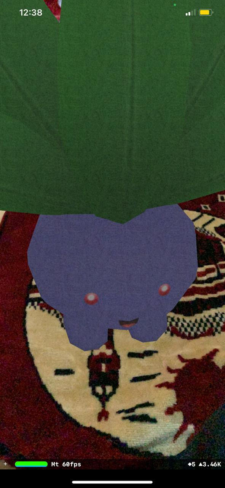
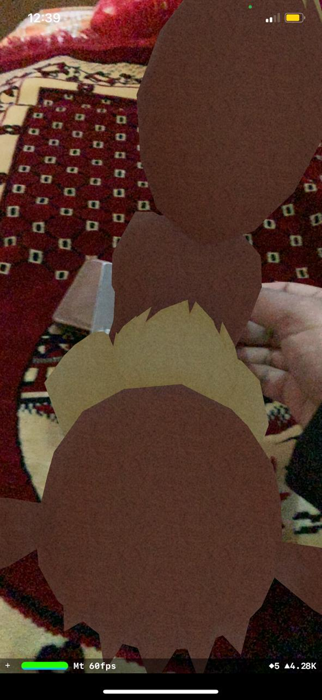

# AR-Poke3D App

## An app that use augmented reality via camera to create pokemon models like Eevee and Oddish.

* Used Augmented Reality.
* Used SceneKit to implement plane so can the user position the models of the Pokemon.
* Download some pokemon models from internet.
* Took some pics of two cards and sized the plane to the card, so when the camera detect any saved card the pokemon model will appear.
* You can take two different card pics but u have to name them as i named to avoid any errors and place them in (Assets.xcassets) Dir.

## Here are some screenshot.

